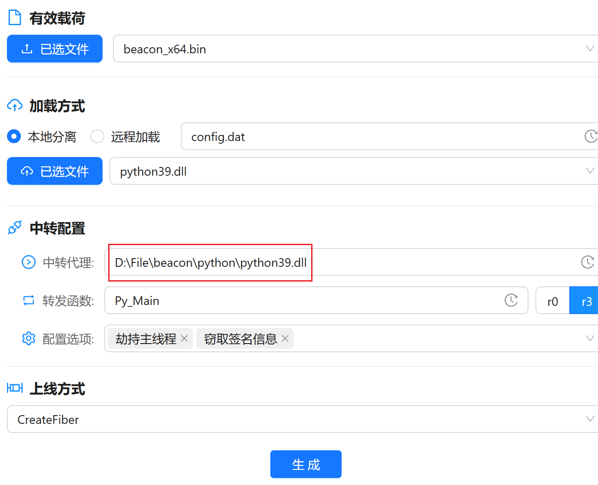
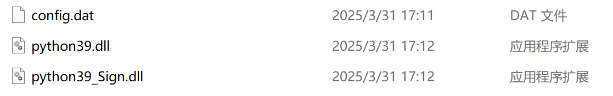

> 一款基于Tauri+Rust的免杀马生成工具
>


## 更新记录
> 2025.03.30 版本V1.1

## 优化内容
1. 优化了历史记录的保存方式
2. exe的文件大小


## 新增内容
1. 新增ollvm编译选项
2. 新增生成文件的创建时间调整
3. 新增生成DLL白+黑的功能
4. 新增日志中心和一些实用工具

## 新增功能使用说明

### DLL劫持
> 仅用于生成dll劫持上线的木马，使用前请先了解DLL劫持上线的相关知识
1. 前提
   - exe调用的dll中的导出函数名称
2. 使用说明
   - 有效载荷：选择cs生成的stageless格式的bin文件
   - 加载方式：本地/远程，远程需要填入访问即可下载文件的地址，例如：https://abc.com/123，并且选择存在DLL劫持的DLL文件。
3. 中转配置
   - 中转代理：需要转发的DLL路径，即原本未被劫持的DLL路径，填写绝对路径，黑DLL会把原本的函数，转发到这个路径进行函数调用，所以这里需要填写上线机器的白DLL路径。
   - 转发函数：即exe调用的DLL中的导出函数名称
   - 配置选项：劫持主线程【当exe不会持续运行时，需要劫持主线程进行运行】。
4. 使用说明
   - 例如`python39.exe`和`python39.dll` `python39.exe`会自动调用`python39.dll`中名为`Py_Main`的函数，
    
    点击生成后会在程序运行目录生成对应加密后的beacon和dll文件
    
    将黑dll+白程序+加密后的beacon放到同一目录下，运行exe即可上线，如果遇到运行存在dos框的exe可以使用实用工具中的去除黑框进行去除。
    


### Ollvm
1. 使用此功能需要使用特定版本的 toolchain `nightly-2024-06-26-x86_64-pc-windows-msvc`
2. 安装方法
   - rustup install nightly-2024-06-26-x86_64-pc-windows-msvc
   - rustup default nightly-2024-06-26-x86_64-pc-windows-msvc


## 项目地址
```plain
https://github.com/lv183037/MaLoader
```

## 环境依赖
### 安装rust
> rust官网
>

[https://www.rust-lang.org/tools/install](https://www.rust-lang.org/tools/install)


### 修改cargo源
> 创建文件 `C:\Users\用户名\.cargo\config.toml`，也可以修改为其他源
>

```plain
[source.crates-io]
replace-with = 'rsproxy-sparse'
[source.rsproxy]
registry = "https://rsproxy.cn/crates.io-index"
[source.rsproxy-sparse]
registry = "sparse+https://rsproxy.cn/index/"
[registries.rsproxy]
index = "https://rsproxy.cn/crates.io-index"


# 清华⼤学
[source.tuna]
registry = "https://mirrors.tuna.tsinghua.edu.cn/git/crates.io-index.git"
 
# 中国科学技术⼤学
[source.ustc]
registry = "git://mirrors.ustc.edu.cn/crates.io-index"
```

### 安装msvc
> 安装msvc的编译环境
>

1. 下载 `Visual Studio Installer` [https://visualstudio.microsoft.com/zh-hans/downloads/](https://visualstudio.microsoft.com/zh-hans/downloads/)


2. 运行后安装`MSVC工具链`即可


## 使用方法
> 由于打包后的exe过大，故使用了upx加壳，release中的app.exe 是原版的应用，不放心的师傅可以放在虚拟机中运行，因考虑到免杀性需求，部分代码暂未开源。
>

1. 首次运行后会在当前目录下生成`history.json`文件用于保存历史记录，`bundle`和`static`目录下放置的是默认的捆绑文件与图标，删除后会影响默认配置的生成，当前支持三种加载方式，点击生成后会默认在当前目录下生成对应的木马和需要分离加载的`beacon`。
2. bundle和static目录下放的是内置一些文件，更改后会默认选项的生成，也可以从本地自行选择文件进行加载，点击生成后会保存历史记录到`history.jso`文件，下次打开时可直接选用相应选项。
3. console选项开启后，beacon运行时会开启cmd窗口。
4. tools目录下，`MSBbuild.exe`是内置的微软签名文件，`rcedit.exe`用于添加文件信息，`sigthief.exe`是打包好的`sigthief.py`文件，`SharpIncrease.exe`可用于某些情况下膨胀文件体积用于bypassqvm，删除或更换名称也会影响内置选项。
5. 选择绑定文件后，默认会在当前目录生成绑定的文件。
6. 配置选择中的终端杀软情况和终端操作系统，是笔者个人针对不同杀软测试禁用了一些选项，结果可能不准确，具体免杀性可自行测试，这里仅供参考。
7. 反沙箱这里出口IP用的是Github和微步上收集的一些微步沙箱的出口地址，常用软件检测的是微信、企业微信、钉钉。

### windows7/server
> win7及以下的系统需要安装nightly版本的rust进行编译
>

```plain
rustup install nightly-2023-12-14-x86_64-pc-windows-msvc
rustup default nightly-2023-12-14-x86_64-pc-windows-msvc
```

> 同时需要在`C:\Users\用户名\.cargo\config.toml`中，添加如下代码
>

```toml
[target.'cfg(all(windows, target_env = "msvc"))']
rustflags = [
  "-C",
  "target-feature=+crt-static",
  "-C",
  "link-arg=-Wl,-Bstatic",
  "-C",
  "link-arg=-Wl,-Bdynamic",
]
```

> 由于rust版本库支持的原因，部分反沙箱和调试的功能与部分加载方式，在win7或者windows sever上无法正常运行，推荐使用如下配置生成木马，笔者自行测试在win7和server上均可正常运行。
>


## 免杀效果
### 微步


### defender
> 实测defender会检测uuid的加载方式，实战遇到defender可以换其他类型的加密方式
>


### 火绒
> 实测几种加密方式和加载方式均可上线
>


### 360核晶
> qvm极其不稳定，如果遇到360报毒qvm，可尝试更换签名与图标或者优先使用`UUID`和`MAC`加密，或使用`tools/SharpIncrease.exe`进行文件膨胀
>

```plain
SIncrease.exe -D target.exe -S 4 -O output.exe
```


### 卡巴斯基免费版
> 内存查杀可以配合<font style="color:rgb(51, 51, 51);">Arsenal Kit进行beacon二开</font>
>


## 免责声明
> <font style="color:rgb(31, 35, 40);">该工具仅用于安全研究，禁止使用工具发起非法攻击等违法行为，造成的后果使用者负责。免杀具有时效性，免杀效果无法保证。</font>
>

1. <font style="color:rgb(31, 35, 40);">仅限用于技术研究和获得正式授权的攻防项目，请使用者遵守《中华人民共和国网络安全法》，切勿用于任何非法活动，若将工具做其他用途，由使用者承担全部法律及连带责任，作者及发布者不承担任何法律及连带责任！</font>
2. <font style="color:rgb(31, 35, 40);">为了保证免杀持久性，暂不进行开源，测试尽量通过本地断网环境，避免多次上传沙箱。</font>
3. <font style="color:rgb(31, 35, 40);">自开发程序无后门，不放心可移至虚拟机使用！</font>

## 参考
[https://github.com/b1nhack/rust-shellcode](https://github.com/b1nhack/rust-shellcode)

[https://github.com/joaoviictorti/RustRedOps](https://github.com/joaoviictorti/RustRedOps)

## 
